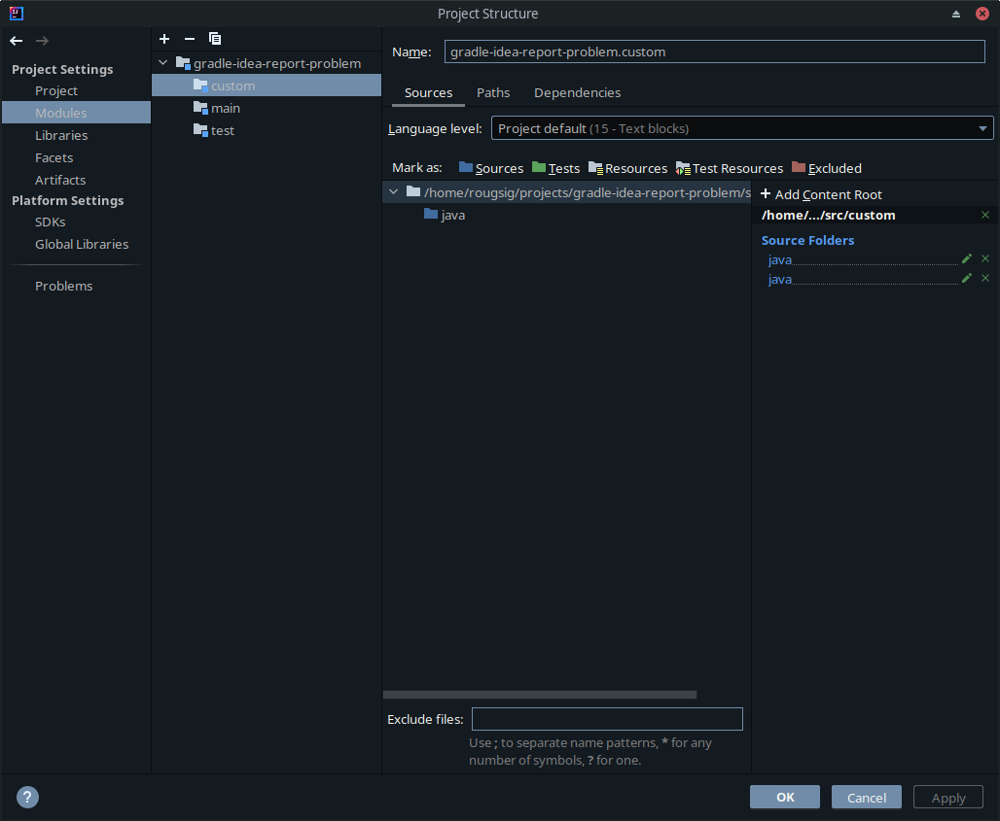

# Gradle :idea report problem

### What's wrong
In `build.gradle` user adds these lines:
```groovy
sourceSets {
  custom {
    java {
      srcDir 'src/custom/java'
    }
  }
}
```

Idea recognise `srs/custom/java` as source root.

But `:ideaModule` task does not add `src/custom/java` as `sourceFolder`.

Result file from `:ideaModule` task `gradle-idea-report-problem.iml`:
```xml
<?xml version="1.0" encoding="UTF-8"?>
<module relativePaths="true" type="JAVA_MODULE" version="4">
  <component name="NewModuleRootManager" inherit-compiler-output="true">
    <exclude-output/>
    <orderEntry type="inheritedJdk"/>
    <content url="file://$MODULE_DIR$/">
      <sourceFolder url="file://$MODULE_DIR$/src/main/java" isTestSource="false"/>
      <excludeFolder url="file://$MODULE_DIR$/.gradle"/>
      <excludeFolder url="file://$MODULE_DIR$/build"/>
    </content>
    <orderEntry type="sourceFolder" forTests="false"/>
  </component>
  <component name="ModuleRootManager"/>
</module>
```

### How to reproduce
1. Clone this project
2. Open in IDEA
3. Run `rm gradle-idea-report-problem.iml && ./gradlew ideaModule`
4. Compare `gradle-idea-report-problem.iml` report with `File > Project Structure`

### Questions
1. That difference between report and idea logic is expected behaviour?
2. If yes, How can I check in unit test what the IDEA knows about the `custom` sourceSet?
